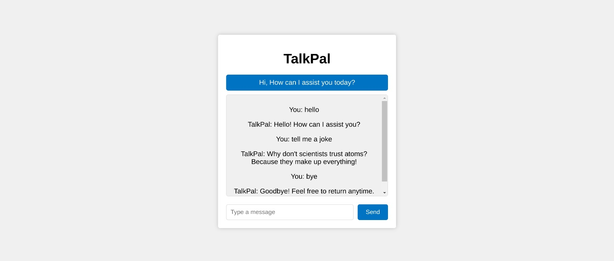

# TalkPal

## Overview

TalkPal is a simple chatbot designed to engage in conversations and provide predefined responses to user queries. It's a great starting point for creating more sophisticated chatbots by extending its functionality and using local responses.

## Features

- Predefined Responses: TalkPal offers predefined responses to common user inputs and questions.
- User-Friendly Interface: The chat interface is designed for an enjoyable user experience.
- Customizable: You can extend and modify TalkPal to suit your specific use case or industry.
